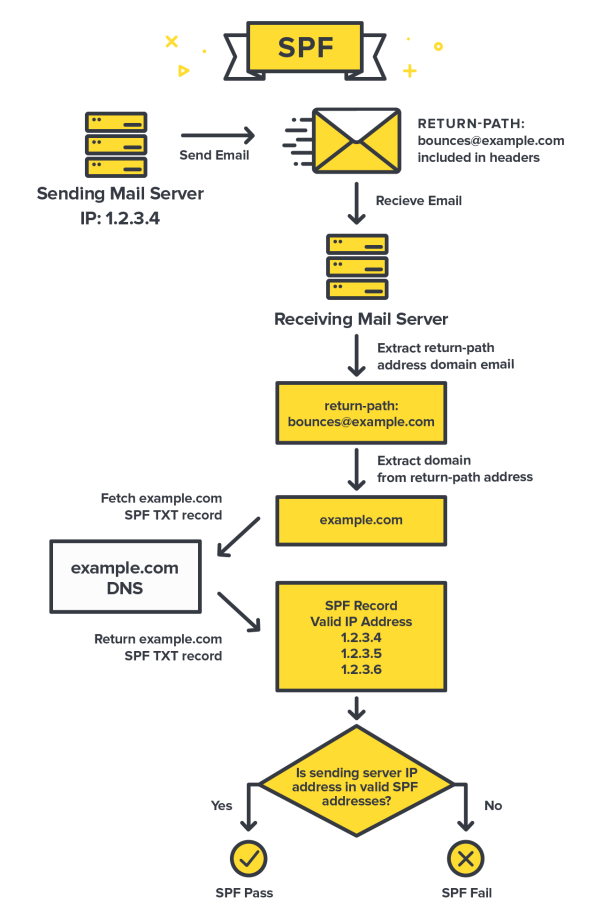

# Email Security Configuration Guide
## 1. SPF [^1]
### 1.1. SPF Record Lookup
```
nslookup -type=TXT example.com
nslookup -q=TXT example.com
dig TXT example.com
dig -t TXT example.com
dig TXT example.com @1.1.1.1
```
#### Example
```
$ nslookup -type=TXT google.com
google.com      text = "v=spf1 include:_spf.google.com ~all"
```
```
$ dig TXT google.com
google.com.             0       IN      TXT     "v=spf1 include:_spf.google.com ~all"
```

### 1.2. SPF DNS Text Record Breakdown
#### SPF Qualifiers
| Qqualifier | Description                              |
| :--------: | :--------------------------------------- |
| +          | Pass (Default Value, and can be omitted) |
| -          | Fail                                     |
| ~          | SoftFail (Accepted but tagged)           |
| ?          | Neutral (NONE)                           |

#### SPF Version
| Parameter | Description                                          |
| :-------- | :--------------------------------------------------- |
| v=spf1    | SPF version. (No other version is currently in use.) |

#### SPF Mechanisms
| Parameter           | Description                                                                                         |
| :------------------ | :-------------------------------------------------------------------------------------------------- |
| all                 | Always match                                                                                        |
| a                   | Authorizes the host detected in the A or AAAA record of the domain to send the emails.              |
| mx                  | An MX record of the queried (or explicitly specified) domain contains the IP address of the sender. |
| ptr (:exclamation:) | The hostname(s) for the client IP is looked up using PTR queries. `AVOID USING THIS MECHANISM`      |
| ip4                 | Authorized IPv4 address/subnet to send emails. If no prefix-length is given, /32 is assumed.        |
| ip6                 | Authorized IPv6 address/subnet to send emails. If no prefix-length is given, /128 is assumed.       |
| include             | Defines other authorized domains.                                                                   |
| exists              | IP address of the sender based on the connection of the client or other criteria.                   |

#### SPF Modifiers (Optional)
| Parameter | Description                                                                                                                               |
| :-------- | :---------------------------------------------------------------------------------------------------------------------------------------- |
| redirect  | IP address of the sender is legitimized by the SPF record of another domain. If there is an `all` mechanism anywhere in the record, the `redirect` is completely ignored. An SPF record with a `redirect` should not contain the `all` mechanism. |
| exp       | Used to provide an explanation when a FAIL quantifier is included on a matched mechanism. This explanation will be placed in the SPF log. |

#### Results of Evaluation
| Value     | Description                                                                              | Action           |
| :-------- | :--------------------------------------------------------------------------------------- | :--------------- |
| Pass      | The SPF record designates the host to be allowed to send                                 | accept           |
| Fail      | The SPF record has designated the host as NOT being allowed to send                      | reject           |
| SoftFail  | The SPF record has designated the host as NOT being allowed to send but is in transition | accept but mark  |
| Neutral   | The SPF record specifies explicitly that nothing can be said about validity              | accept           |
| None      | The domain does not have an SPF record or the SPF record does not evaluate to a result   | accept           |
| PermError | A permanent error has occurred (ex: badly formatted SPF record)                          | unspecified      |
| TempError | A transient error has occurred                                                           | accept or reject |

### 1.3. SPF Verification Mechanism
  
Reference: [SPF record: Protect your domain reputation and email delivery](https://postmarkapp.com/guides/spf)

---


## 2. DKIM [^2]
### 2.1. DKIM Record Lookup
```
nslookup -type=TXT <selector>._domainkey.example.com
nslookup -q=TXT <selector>._domainkey.example.com
dig TXT <selector>._domainkey.example.com
dig -t TXT <selector>._domainkey.example.com
dig TXT <selector>._domainkey.example.com @1.1.1.1
```
#### Example
```
$ nslookup -type=TXT arcselector9901._domainkey.microsoft.com
arcselector9901._domainkey.microsoft.com        text = "v=DKIM1; k=rsa; p=MIIBIjANBgkqhkiG9w0BAQEFAAOCAQ8AMIIBCgKCAQEAohCECx8ACVIj42taMc8G2ljiDmsboUW4mgasOg3/2Ay1D37DwK0CE1aok6x0x6dQ4FC/NGdeksPjT/ZLYH+zwwUvElJwd8adtZK4E7AT9Rzr6WPtTiFHi87em6n12HTvp8plpGHXnm8vdFrTxcCUguwUBzbe6MB12Dc3vSURcOUqfa6Dlj/6cNehl+PMonql" "LxOl2KmpTJ/Vy9jhdFOu50xEhXIT5ocOa4tX12hfoMpZfBW6iU5QIyvnEFkJuF8Ibs7Hhr7Ec1GZc6tgOd5uNTAnnvh+xiYs8e722H5iDecMsBzj+I9U+CBY1ACwY9hTC1UDNu3xS+WKQNgvnifdIQIDAQAB"
```
```
$ dig TXT arcselector9901._domainkey.microsoft.com
arcselector9901._domainkey.microsoft.com. 0 IN TXT "v=DKIM1; k=rsa; p=MIIBIjANBgkqhkiG9w0BAQEFAAOCAQ8AMIIBCgKCAQEAohCECx8ACVIj42taMc8G2ljiDmsboUW4mgasOg3/2Ay1D37DwK0CE1aok6x0x6dQ4FC/NGdeksPjT/ZLYH+zwwUvElJwd8adtZK4E7AT9Rzr6WPtTiFHi87em6n12HTvp8plpGHXnm8vdFrTxcCUguwUBzbe6MB12Dc3vSURcOUqfa6Dlj/6cNehl+PMonql" "LxOl2KmpTJ/Vy9jhdFOu50xEhXIT5ocOa4tX12hfoMpZfBW6iU5QIyvnEFkJuF8Ibs7Hhr7Ec1GZc6tgOd5uNTAnnvh+xiYs8e722H5iDecMsBzj+I9U+CBY1ACwY9hTC1UDNu3xS+WKQNgvnifdIQIDAQAB"
```

### 2.2. DKIM-Signature Email Header Breakdown

| Parameter | Description                                                                                    |
| :-------- | :--------------------------------------------------------------------------------------------- |
| v=1      	| The version of the DKIM specification. (No other version is currently in use.)                 |
| a=       	| The algorithm that was used to create the signature.                                         	 |
| c=       	| The canonicalization algorithms that were used for the header and the body.                    |
| d=      	| The domain claiming responsibility for transmitting the message.                               |
| s=      	| The selector for the domain.                                                                   |
| bh=     	| **Body hash**: The hash of the body of the message after it was canonicalized, in Base64 form. |
| h=      	| The list of header fields used to create the DKIM signature.                                   |
| b=      	| The DKIM signature data, in Base64 form.                                                       |
| t=      	| The time of the message, in Epoch time.                                                        |
| x=      	| The DKIM signature expiration time. (MUST BE: x > t)                                           |

#### Canonicalization Algorithms

| Header  | Body    |
| :-----: | :-----: |
| relaxed | relaxed |
| relaxed	| simple  |
| simple  | relaxed |
| simple  | simple  |

```
"c=simple/simple"
"c=relaxed/simple"
```

##### Header Algorithms
| Algorithm | Description                                                                                                                                 |
| :-------- | :------------------------------------------------------------------------------------------------------------------------------------------ |
| simple   	| Does not change header fields. In particular, header field names MUST NOT be case-folded and whitespace MUST NOT be changed.                |
| relaxed  	| Convert all header field names (not the header field values) to lowercase. Convert all sequences of one or more WSP characters to a single SP character. Delete all WSP characters at the end of each unfolded header field value. Delete any WSP characters remaining before and after the colon separating the header field name from the header field value. |

##### Body Algorithms
| Algorithm | Description                                                                                                                                                           |
| :-------- | :-------------------------------------------------------------------------------------------------------------------------------------------------------------------- |
| simple   	| Ignores all empty lines at the end of the message body.                                                                                                               |
| relaxed  	| Ignore all whitespace at the end of lines. Reduce all sequences of WSP within a line to a single SP character. Ignore all empty lines at the end of the message body. |

#### Example
```
DKIM-Signature: v=1; a=rsa-sha256; c=relaxed/relaxed; d=gmail.com; s=20161025; h=mime-version:from:date:message-id:subject:to; bh=NuUVBkHAblnFrMSNaWdGtwpjr9poc3wM2sXMhd25sPE=; b=gGpvUwVrIr1IBFW1gZyFDYqvIO63kM27v1T90W5YWsPeXuFHZVuKuaFBO28GkBQJsgogqFsLfIicvDiEs5hPQfuI3SiZmXgizbnNB85ikrNh8oekceHCzcE7Rp4fe9EBiyMOmkVjG1b4q7h7HCqBWOh9zHIpkoT2n6JSK0VpH2nJulKy8YrnAyZAm8on5XAWWVB83OvvU7w4f2UMWPeXZeNNdgk67KmmO9VT3NfwMX8WEhajxcu1ETLPIrsgxROz2GaoNJ4gqDOi/OeZtiT+sTWDxpjkrIcTOygR3Lcgb8D8CELqZOvEr0M9ySimQsobTicF1wOERP2NvaigFPrjVA==
```

### 2.3. DKIM DNS Text Record Breakdown

| Parameter | Description                                                                                            |
| :-------- | :----------------------------------------------------------------------------------------------------- |
| v=DKIM1   | The version of the DKIM specification. (No other version is currently in use.)                         |
| h=       	| Acceptable hash algorithms. (OPTIONAL, defaults to allowing all algorithms).                           |
| k=       	| Key type. (OPTIONAL, default is "rsa")                                                                 |
| n=      	| Notes that might be of interest to a human.                                                            |
| p=      	| Public-key data (base64; REQUIRED).  An empty value means that the public key has been revoked.        |
| s=     	  | Service Type (OPTIONAL; default is "*").                                                               |
| t=      	| Flags, represented as a colon-separated list of names (OPTIONAL, default is no flags set).             |

#### Example
```
v=DKIM1; k=rsa; p=MIIBIjANBgkqhkiG9w0BAQEFAAOCAQ8AMIIBCgKCAQEAohCECx8ACVIj42taMc8G2ljiDmsboUW4mgasOg3/2Ay1D37DwK0CE1aok6x0x6dQ4FC/NGdeksPjT/ZLYH+zwwUvElJwd8adtZK4E7AT9Rzr6WPtTiFHi87em6n12HTvp8plpGHXnm8vdFrTxcCUguwUBzbe6MB12Dc3vSURcOUqfa6Dlj/6cNehl+PMonql"
```

### 2.4. DKIM Verification Mechanism
  
Reference: [How do DKIM and DKIM records work?](https://postmarkapp.com/guides/dkim/how-does-dkim-work)


---


## 3. DMARC [^3]
### 3.1. DMARC Record Lookup
```
nslookup -type=TXT _dmarc.example.com
nslookup -q=TXT _dmarc.example.com
dig TXT _dmarc.example.com
dig -t TXT _dmarc.example.com
dig TXT _dmarc.example.com @1.1.1.1
```
#### Example
```
$ nslookup -type=TXT _dmarc.google.com
_dmarc.facebook.com     text = "v=DMARC1; p=reject; rua=mailto:a@dmarc.facebookmail.com; ruf=mailto:fb-dmarc@datafeeds.phishlabs.com; pct=100"
```
```
$ dig TXT _dmarc.google.com
_dmarc.facebook.com.    0       IN      TXT     "v=DMARC1; p=reject; rua=mailto:a@dmarc.facebookmail.com; ruf=mailto:fb-dmarc@datafeeds.phishlabs.com; pct=100"
```

### 3.2. DMARC DNS Text Record Breakdown

| Parameter | Description                                                                                                               |
| :-------- | :------------------------------------------------------------------------------------------------------------------------ |
| v=DMARC1  | **Version**: The version of the DMARC specification. (No other version is currently in use.)                              |
| p=        | **Policy**: The policy that should be followed for the domain. The possible values are none, quarantine or reject.        |
| sp=       | **Subdomain policy**: This specifies the policy that should be followed for subdomains.                                   |
| pct=      | **Percentage**: The percentage of emails that should be subjected to filtering.                                           |
| ruf=      | **Forensic report email address**: The email address that forensic reports should be sent to.                             |
| rua=      | **Aggregate report email address**: The email address that aggregate reports should be sent to.                           |
| aspf=     | SPF domain alignment mode. Possible values: `r` (relaxed) or `s` (strict). `Not related to DKIM Canonicalization modes.`  |
| adkim=    | DKIM domain alignment mode. Possible values: `r` (relaxed) or `s` (strict). `Not related to DKIM Canonicalization modes.`	|
| fo=       | **Forensic reporting options**: Defines how forensic reports are created and sent to users. Possible values: `0, 1, d, s` |
| rf=       | **Report format**: The forensic reporting format.                                                                         |
| ri=       | **Report interval**: The frequency of the reports.                                                                        |

### 3.3. DMARC Verification Mechanism
  
Reference: [DMARC: What is it and why do you need it?](https://postmarkapp.com/guides/dmarc)


[^1]: [RFC 7208: Sender Policy Framework (SPF)](https://www.rfc-editor.org/rfc/rfc7208)
[^2]: [RFC 6376: DomainKeys Identified Mail (DKIM) Signatures](https://www.rfc-editor.org/rfc/rfc6376.html)
[^3]: [RFC 7489: Domain-based Message Authentication, Reporting, and Conformance (DMARC)](https://www.rfc-editor.org/rfc/rfc7489)


